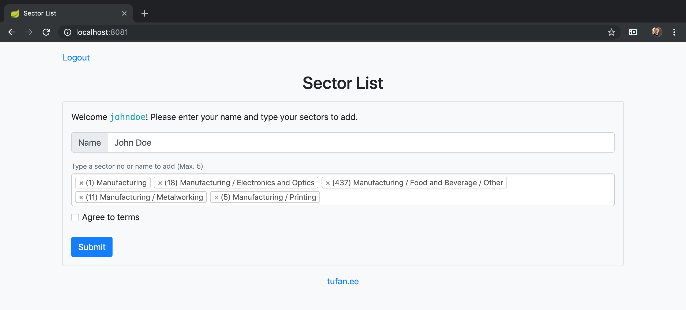

# Sector Selector

## Task
1. Correct all of the deficiencies in [`_index.html`](src/main/resources/templates/_index.html)
2. `Sectors` selectbox:
	1. Add all the entries from the `Sectors` selectbox to database
	2. Compose the `Sectors selectbox using data from database
3. Perform the following activities after the `Save` button has been pressed: 
	1. Validate all input data (all fields are mandatory)
	2. Store all input data to database (Name, Sectors, Agree to terms)
	3. Refill the form using stored data 
	4. Allow the user to edit his/her own data during the session
## Contributing
Pull requests are welcome.
## License
[MIT](LICENSE)